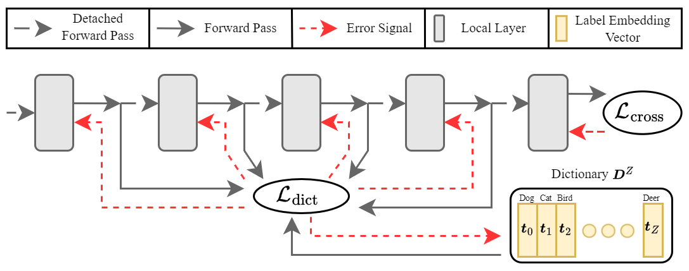

# DCL: Dictionary Contrastive Learning for Efficient Local Supervision without Auxiliary Networks
#### Suhwan_Choi, Myeongho Jeon, Yeonjung Hwang, Jeonglyul Oh, Sungjun Lim, Joonseok Lee, Myungjoo Kang
Official PyTorch implementation of Dictionary Contrastive Learning (ICLR 2024 Spotlight) \
[Paper](https://openreview.net/pdf?id=Gg7cXo3S8l)

<center></center>

## Installation
Clone the repository and install dependencies.
```shell
# the codebase has been tested on Python 3.8 / 3.10 with PyTorch 1.12.1 / 1.13 conda binaries
git clone https://github.com/schoi828/DCL.git
conda env create -f environment.yml
pip install -r requirements.txt
```

### Training 
To initiate training, execute the script run_exp.sh. Ensure to specify the architecture, dataset, training method, experiment identifier, GPU ID, and seed value. Default training configurations, such as batch size, are preset to the values utilized in our study for your convenience. 
``` shell
#architecture: simple256, simple512, fc, vgg8b
#dataset: MNIST, CIFAR10, CIFAR100, CIFAR20, SVHN, STL10, fMNIST, kMNIST
#method: BP, DCL, FEAT
#              arch    dataset   method   exp_name   gpu    seed
bash train.sh  fc      CIFAR10   DCL      train      1      0   &
```
